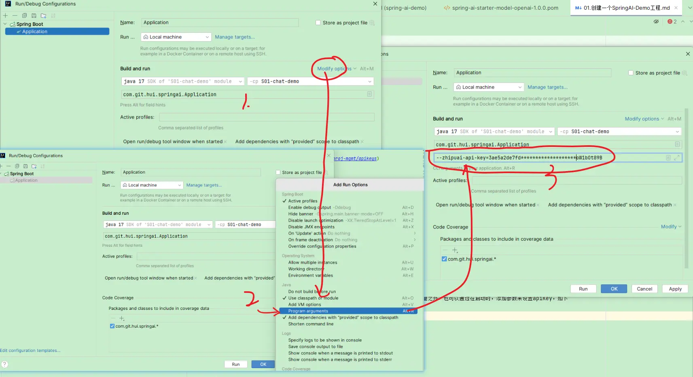

# ai-oc

## 后端工程

后端相关工程放置在 [app](app/) 目录下

### 技术栈

jdk17 + SpringBoot3.5.3 + H2/MySql + SpringJPA + SpringAI

### 启动

本地开发时，数据库指向h2，直接启动即可；如果需要体验大模型的数据抓取录入，需要修改启动参数

1. 到智谱清言申请账号，注册一个API Key
   - api申请地址: [智谱清言API Key](https://open.bigmodel.cn/usercenter/proj-mgmt/apikeys)

2. 传入大模型ApiKey
   a. 命令行传参方式
      - 编辑启动命令
      - 点击 Modify options, 在菜单栏中，开启 `Program arguments`
      - 添加命令行参数 `--zhipuai-api-key=xxx`

   

   b. 直接修改配置参数
      - 打开文件： [application-ai.yml](app/src/main/resources-env/dev/application-ai.yml)
      - 修改参数: `api-key:` 

3. 入口类，直接启动


说明：

- dev 环境：使用h2数据库, 对应的数据库文件为：[app/src/main/resources/ai-oc.mv.db](app/src/main/resources/ai-oc.mv.db)
- test/prod 环境：使用MySql数据库


## 前端工程

前端相关工程放置在 [ui-react](ui-react/) 目录下

### 技术栈

react + next.js + tailwindcss

推荐nodejs=18.x, next.js=15+

### 启动

```bash
# 安装依赖
pnpm install

# 本地开发
pnpm dev

# 打包
pnpm build 

# 发布到SpringBoot的static目录下
pnpm run deploy
```